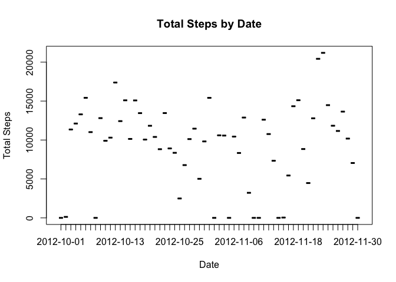

# Reproducible Research: Peer Assessment 1
# My First Attempt at Both knitr and Motion Tracking Analysis!  

### Ryan Monroe, courtesty of the tutelage of Dr. Peng  

First, let us configure some global settings for this document,  
namely let us make sure that all subsequent R code is echoed in  
the processed .md and .html files:  


```r
library(knitr)
opts_chunk$set(echo = TRUE)
```

## Loading and preprocessing the data

First, let us read the data using the read.csv function, and assign it  
to the variable "raw_act". We'll then examine the summary of this initial, 
"raw" import:  


```r
raw_act <- read.csv("activity.csv")
```

Next, let's look at some basic information about the data using the summary  
and str functions:  


```r
str(raw_act)
```

```
## 'data.frame':	17568 obs. of  3 variables:
##  $ steps   : int  NA NA NA NA NA NA NA NA NA NA ...
##  $ date    : Factor w/ 61 levels "2012-10-01","2012-10-02",..: 1 1 1 1 1 1 1 1 1 1 ...
##  $ interval: int  0 5 10 15 20 25 30 35 40 45 ...
```

```r
summary(raw_act)
```

```
##      steps                date          interval     
##  Min.   :  0.00   2012-10-01:  288   Min.   :   0.0  
##  1st Qu.:  0.00   2012-10-02:  288   1st Qu.: 588.8  
##  Median :  0.00   2012-10-03:  288   Median :1177.5  
##  Mean   : 37.38   2012-10-04:  288   Mean   :1177.5  
##  3rd Qu.: 12.00   2012-10-05:  288   3rd Qu.:1766.2  
##  Max.   :806.00   2012-10-06:  288   Max.   :2355.0  
##  NA's   :2304     (Other)   :15840
```

The str function shows us that the steps and interval columns are integer class,  
while the date column is of a factor class. For the sake of easier manipulation  
later in the assignment, let's add two columns: one with the date values  
converted to POSIXlt, the other with the seconds interval converted to factor:  


```r
raw_act$posixlt <- as.POSIXlt(raw_act$date)
raw_act$factorval <- as.factor(raw_act$interval)
```

We will also want to see what differences there are in the data on weekends  
versus weekdays, so let's add a factor class column of the dates, using both  
weekdays() and as.factor():  


```r
raw_act$day <- as.factor(weekdays(raw_act$posixlt))
```


## What is mean total number of steps taken per day?

Based on our initial analysis of the raw data using the str() function,  
we know that there are 61 days. Let's look first at the average steps taken  
across those days, simply dividing the total steps (after removing NA values)  
by 61:  


```r
allsteps <- sum(raw_act$steps, na.rm = TRUE)
allsteps/61
```

```
## [1] 9354.23
```

Next, let's look at the total steps accrued each of the 61 days, by way of  
histogram.  As always, we'll remove the NA data cells.  

We'll do this by first splitting the steps data by the conditional  
variable of date (here, we'll create a vector of unique dates), then sum each  
day's steps, then plug this into a histogram:  


```r
eachdaysteps <- split(raw_act$steps, raw_act$date)
stepsperday <- sapply(eachdaysteps, sum, na.rm = TRUE)
uniquedates <- unique(raw_act$date)
plot(uniquedates, stepsperday, main = "Total Steps by Date", xlab = "Date", ylab = "Total Steps", type = "h", col = "green")
```

<!-- -->

To calculate the mean and median steps per day, we simply use the aforementioned  
sum of each day's steps (here, the vector "stepsperday"), and apply the mean  
and median functions:


```r
mean(stepsperday)
```

```
## [1] 9354.23
```

```r
median(stepsperday)
```

```
## [1] 10395
```


## What is the average daily activity pattern?

We're going to make a time-series plot looking at the average number of steps per  
5-minute interval. We'll create a new vector of steps split by unique 5-minute  
interval. We'll then create another vector by averaging each of those 5-minute  
interval step vectors. We can then create a line plot of these averages as a  
function of each 5-minute interval (a vector we'll create using the unique fxn)  


```r
eachintervalsteps <- split(raw_act$steps, raw_act$factorval)
avg_int_steps <- sapply(eachintervalsteps, mean, na.rm = TRUE)
uniqueinterval <- unique(raw_act$factorval)
plot(uniqueinterval, avg_int_steps, type = "l", main = "Average Steps per 5-Minute Interval", xlab = "5-Minute Interval", ylab = "Average Steps", col = "red")
```

<!-- -->

The second step here is to compute the 5-minute interval that, on average across  
all the days in the data set, had the largest average steps. To do this, we will  
find the maximum value in the vector of average steps per 5-minute interval.  
Then, we'll determine which 5-minute interval is associated with that value,  
first by determining which position (or row) in which the maximum value resides.  
Then, we'll cross-index that row against the column of unique 5-minute intervals:  


```r
max_steps <- max(avg_int_steps)
max_interval_index <- as.numeric(which(avg_int_steps == max_steps))
max_interval <- uniqueinterval[max_interval_index]
print(max_interval)
```

```
## [1] 835
## 288 Levels: 0 5 10 15 20 25 30 35 40 45 50 55 100 105 110 115 120 ... 2355
```


## Imputing missing values

We can see from your initial summary of the raw data that there are 2,304 missing  
values (NAs), using the summary() function (See "Loading and Preprocessing  
the data").  

We'll use our 5-minute interval average step values from the section above to  
fill in the missing values. 


```r
interval_table <- data.frame(uniqueinterval, avg_int_steps)
for (i in 1:nrow(raw_act)) {
    if (is.na(raw_act$steps[i])) {
        blankstepsinterval <- raw_act$interval[i]
        uniqueindex <- as.numeric(
            which(interval_table$uniqueinterval == blankstepsinterval)
            )
        step_value <- interval_table$avg_int_steps[uniqueindex]
        raw_act$steps[i] <- step_value
    }
}
```

Next, we'll create a new data set from the old one:


```r
new_activity <- raw_act
```

Then we can repeat the creation of our histogram (or, rather, histogram-style  
plot) as well as mean and median computations, but with the filled-in data set:  


```r
eachdaystepz <- split(new_activity$steps, new_activity$date)
stepzperday <- sapply(eachdaystepz, sum, na.rm = TRUE)
uniquedatez <- unique(new_activity$date)
plot(uniquedatez, stepzperday, main = "Total Steps by Date", xlab = "Date", ylab = "Total Steps", type = "h", col = "green")
```

<!-- -->


```r
mean(stepzperday)
```

```
## [1] 10766.19
```

```r
median(stepzperday)
```

```
## [1] 10766.19
```

As resulted previously, the original data set yielded mean/median computations  
as such:  
Mean: 9354 steps  
Median: 10395 steps  

The computations with the new data set are as follows:  
Mean: 10766 steps  
Median: 10766 steps  

Both mean and median are increased compared to the raw data set that included NA  
values, unsurprisingly. Amazingly, the mean and median equal one another now....  


## Are there differences in activity patterns between weekdays and weekends?

First, we need to generate a new factor class column using the day column we  
already generated from our date column. 


```r
day_type <- vector()
for (i in 1:nrow(new_activity)) {
    if (new_activity$day[i] == "Saturday") {
        day_type[i] <- "Weekend"
    } else if (new_activity$day[i] == "Sunday") {
        day_type[i] <- "Weekend"
    } else {
        day_type[i] <- "Weekday"
    }
}
new_activity$day_type <- day_type
new_activity$day_type <- as.factor(new_activity$day_type)
```

Then, we'll make a similar time-series plot, only we'll create two panels:  
one for weekends, one for weekdays (this time, using lattice):  


```r
eachintervalstepz <- split(new_activity$steps, new_activity$factorval)
avg_int_stepz <- sapply(eachintervalstepz, mean, na.rm = TRUE)
uniqueintervalz <- unique(new_activity$factorval)
library(lattice)
xyplot(avg_int_stepz ~ uniqueintervalz | day_type, data = new_activity, layout = c(1, 2), type = "l", mt = "Average Steps per 5-Minute Interval, by Day Type", xlab = "5-Minute Interval", ylab = "Average Steps", col = "blue")
```

<!-- -->

Based on these results, it appears as though there are no weekend days where steps
were taken!

